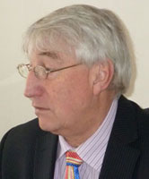

<figcaption>John Jenkins</figcaption>

John Jenkins has been an accountant since 1965.  He completed his training with a local chartered accountancy firm and worked with other companies until the late '80s. The time had come when he decided to start his own business and on the 1st May 1989 *greydells accounting services* was created. John has established a very varied client base and has seen *greydells accounting services* grow from a one man firm to an effective team which includes Nicola Sutton and has seen many earn their apprentiship in the company.

In his spare time John enjoy's travelling with his wife, mostly in their motorhome.  They like to cycle along the rivers and canals the world has on offer.

---

<figcaption>Nicola Sutton</figcaption>

Nicola Sutton MAAT has a solid education and has trained and passed the Association of Accounting Technicians.  Since her time at *greydells accounting services* she has proven to be a great accountant excelling in payroll, VAT and CIS.

Nicola lives with her partner and two children.  She takes a keen interest in supporting the children's sporting ventures, including being the treasurer of the local rugby club.